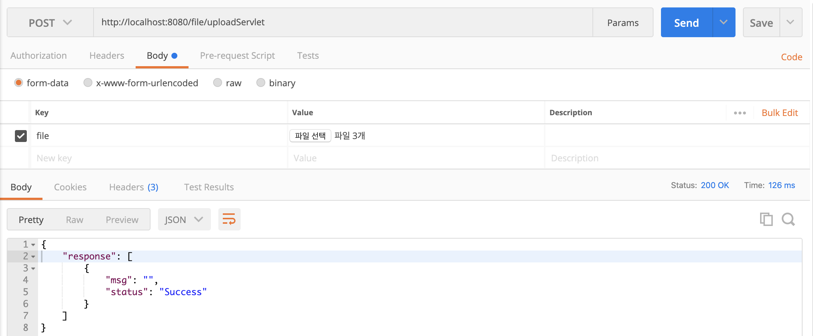
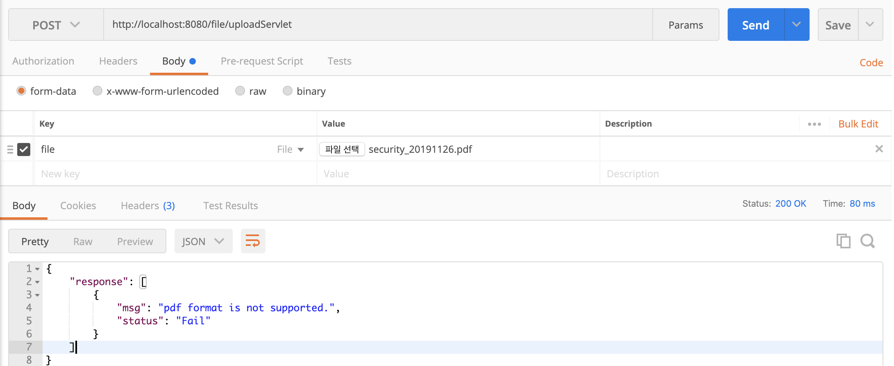

# File
UI없이 파일업로드를 테스트 할 수 있는 코드구현

## 1. 사용 라이브러리

- commons-fileupload-1.4.jar
- commons-io-2.6.jar
- json-simple-1.1.1.jar
- commons-logging-1.2.jar
- spring-beans-4.0.9.jar
- spring-context-4.0.9.jar
- spring-core-4.0.9.jar
- spring-expression-4.0.9.jar

## 2. 테스트환경

- Postman

## 3. BeansUtils.java
bean 파일 정보를 가져온다.

## 4. UploadServlet.java
UI없이 Postman 테스트하기 위해서 servlet구조로 작성

## 5. output.java
파일업로드 통신 결과를 json형태로 나타내기 위해 별도로 구현

## 6. FileUploadUtil.java
여러 조건들을 검사한 후 파일업로드
- 시큐어코딩 조건 충족
- multipart/form-data 인지 검사
- 업로드할 총 파일의 크기 제한
- 파일확장자 제한
- 중복된 파일명에 대한 처리 및 제한
  - YYYY/MM/DD폴더 만든다.
  - 그 폴더 밑에 "난수_파일명"를 사용하여 중복파일 방지
- 파일개수 제한
- bean에 파일정보 저장

## 7. 테스트 결과
1) 성공

2) 실패

## 참고자료

- https://jtoday.tistory.com/87 (시큐어코딩)
- https://openeg.co.kr/371 (시큐어코딩)