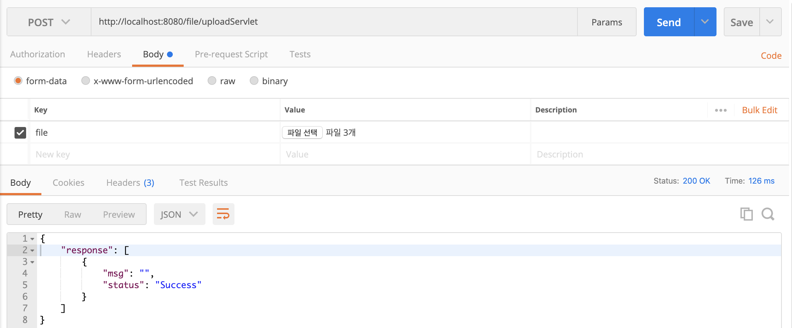
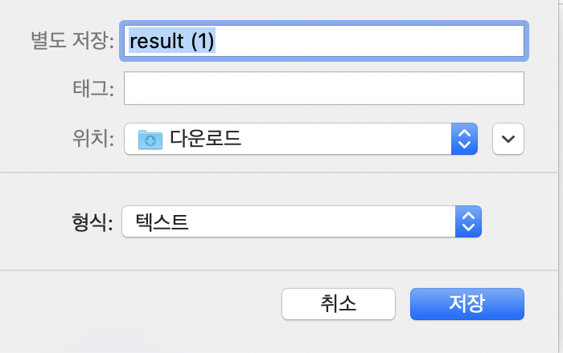
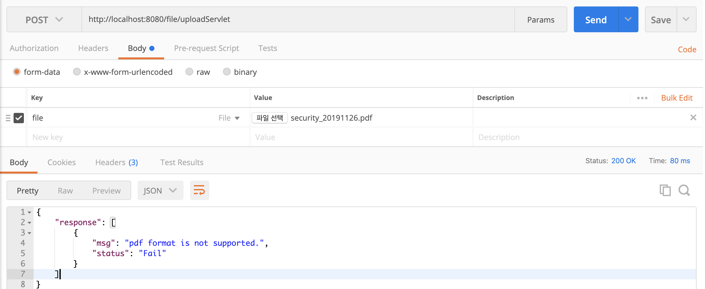
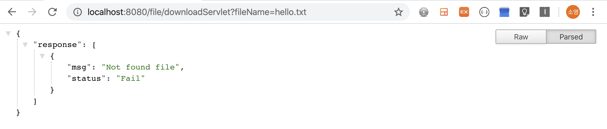

# File
- util.fileUpload.FileUploadUtil 
UI없이 파일업로드를 테스트 할 수 있는 코드구현

- util.fileDownload.FileDownloadUtil 
UI없이 파일다운로드를 테스트 할 수 있는 코드구현

## 1. 사용 라이브러리
- json-simple-1.1.1.jar
- commons-logging-1.2.jar
- spring-beans-4.0.9.jar
- spring-context-4.0.9.jar
- spring-core-4.0.9.jar
- spring-expression-4.0.9.jar
   
- commons-fileupload-1.4.jar
- commons-io-2.6.jar

## 2. 테스트환경
- Postman (파일업로드)
- 웹브라우저 (파일다운로)

## 3. BeansUtils.java
bean 파일 정보를 가져온다.

## 4. output.java
파일업로드 통신 결과를 json형태로 나타내기 위해 별도로 구현

## 5. UploadServlet.java
UI없이 파일다운로드를 Postman으로 테스트하기 위해 servlet구조로 작성 (POST 방식)

## 6. FileUploadUtil.java
여러 조건들을 검사한 후 파일업로드
- 시큐어코딩 조건 충족
- multipart/form-data 인지 검사
- 업로드할 총 파일의 크기 제한
- 파일확장자 제한
- 중복된 파일명에 대한 처리 및 제한
  - YYYY/MM/DD폴더 만든다.
  - 그 폴더 밑에 "난수_파일명"를 사용하여 중복파일 방지
- 파일개수 제한
- bean에 파일 업로드 정보 저장

## 7. DownloadServlet.java
UI없이 파일다운로드를 테스트하기 위해 servlet구조로 작성 (GET 방식)

## 8. FileDownloadUtil.java
여러 조건들을 검사한 후 파일다운로드
- 파일이름에 상대경로 지정불가 (시큐어코딩 조건)
- 파일 존재여부 체크
- 파일 확장자 처리
- bean에 파일 다운로드 정보 저장

## 9. 테스트 결과
1. 성공 
1-1. 파일업로드

  
1-2. 파일다운로드 

2. 실패 
2-1. 파일업로드

  
2-2. 파일다운로

## 참고자료
- http://www.devkuma.com/books/pages/1159 (시큐어코딩)
- https://jtoday.tistory.com/87 (시큐어코딩)
- https://openeg.co.kr/371 (시큐어코딩)
